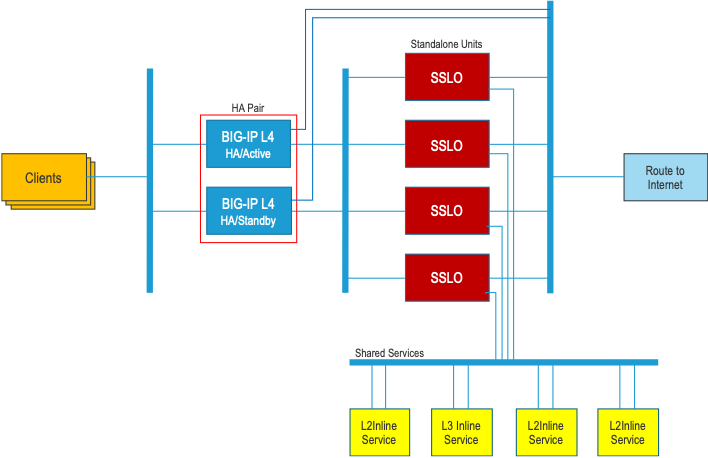
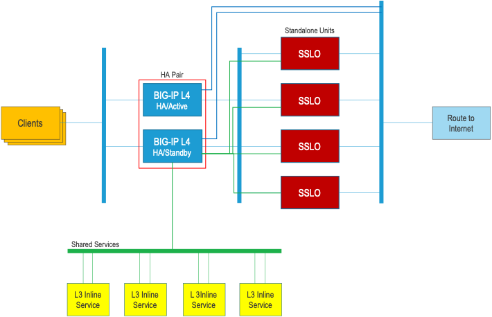
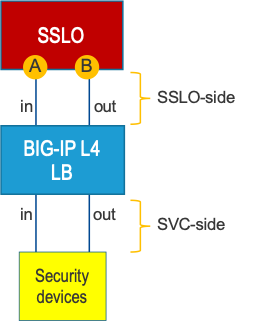

# F5 SSL Orchestrator External Layered Architecture (DRAFT)
A configuration scheme and toolset to deploy SSL Orchestrator in an external layered (load balanced) architecture.

### Version support
This utility works on BIG-IP 14.1 and above, SSL Orchestrator 5.x and above.

### Description 
In the traditional SSL Orchestrator model, a single or HA pair of F5 devices is inserted inline of the traffic flow, and security services attach directly (or indirectly) to these. At the very least, this dictates the size of appliances used to facilitate the full traffic load requirement. And as with any such deployment, if your requirements increase beyond this capacity, you're forced to forklift upgrade. An alternative, scalable approach is to insert SSL Orchestrator appliances in a load balanced configuration (behind a separate L4 load balancer). The frontend appliance is handling L4-only traffic, so its throughput will naturally be much higher, while SSL Orchestrator devices can be added at will as throughput requirements increase.



An added benefit is that a separate "escape" path can be created in the event of a catastrophic failure in the security stack, to maintain availability (if required). This approach does have a disadvantage though, as it becomes more complex to share the security devices between these now standalone SSL Orchestrator appliances. Layer 2 devices require a smart switch fabric between them and the F5 to offload 802.1Q tagged traffic, and layer 3 devices must support policy routing (all to ensure routing back to the correct F5 appliance). Further, as these are standalone SSL Orchestrator appliances, they do not have insight into the load balancing states of the other devices, so may unintentionally overtask security devices.

Another option exists, however, by taking greater advantage of the powerful L4 BIG-IP. In this architecture, the L4 appliance load balances encrypted traffic to the SSL Orchestrator appliance, and these pass decrypted traffic (across different internal VLANs) back to the L4. The L4 then more capably handles load balancing of decrypted traffic to the shared security devices.



This architecture greatly simplifies the SSL Orchestrator configurations, enhances availability, and removes any need for smart switches or policy routing on security devices. But, while this reduced complexity elsewhere, it significantly increases complexity at the L4 appliance. SSL Orchestrator in and of itself is a complex thing. Its guided configuration design obfuscates the creation of an abundance of network objects (VLANs, self-IPs, route domains, VIPs, pools, rules, profiles, etc.). In this external layered design, the SSL Orchestrator appliances need only configure ONE device for each service - a listening instance on the L4, while the L4 must now manually handle all of the wiring that the guided config used to hide. 

In this repository, that complex per-service-type wiring will be thoroughly explained should you want to build it by hand. Otherwise, a toolset is also provided that will do all of this work for you.


### Toolset
The toolset consists of a central Python application and a set of YAML-based configuration files. The YAML files constitute a single source-of-truth for each security device deployed, and defines both sides - how SSL Orchestrator speaks to the service, and how the L4 speaks to the respective devices. Otherwise, the toolset abstracts away as much of the complexity as possible. The individual security service definitions are independent and atomic, allowing for fast creation, modification, and deletion of configurations. In the remaining portion of this README, details of the toolset and YAML file syntax will be described.


### How to install and use
The Python application can either run on your local system (targeting remote BIG-IPs), or directly on the L4 BIG-IP (targeting localhost). Copy the Python application to the desired path and provide it a configuration YAML file.

`python sslo-tier-tool.py --file layer3service1.yml`

The tool will validate the YAML configuration and then push the required settings to the L4 BIG-IP. This tool supports standalone and HA L4 configurations, generally by including separate IPs, interfaces, tags, and floating IPs for each appliance. Also note that updates are disruptive. To facilitate quick and complete updates to network objects, any existing objects for this service are first removed and then rebuilt. This will cause a momentary lapse in traffic flow to this service. It is therefore recommended that the service be taken out of active SSL Orchestrator service chains before performing any management actions.

The following is the detailed YAML configuration syntax for service mapping and each supported security device type:
- [Service mapping](#service-mapping)
- [Layer 3 security service](#service-layer-3)
- [Layer 2 security service](#service-layer-2)
- [HTTP transparent security service](#service-http-transparent)
- [HTTP explicit security service](#service-http-explicit)
- [ICAP security service](#service-icap)
- [Monitoring](#monitoring)

<br />

### <a name="service-mapping"></a>Service mapping
To understand mapping, it is first critical to understand how traffic flows through this architecture. Encrypted traffic from a load balancer (could be the same L4 LB) is distributed to SSL Orchestrator instances. Each SSLO instance is configured roughly the same, only that the service definitions use slightly offset entry and return self-IPs (in the same subnets). As decrypted traffic passes to a service in the service chain, SSLO passes this to a corresponding listener on the L4 LB. This F5 then appropriately load balances the traffic to the set of security devices. These devices will pass the traffic back to the L4 LB, and the L4 LB must then pass the traffic back to the correct SSLO instance. The L4 LB cannot take advantage of split-session signaling as SSL Orchestrator does, so must use a different method to ensure proper return routing to an SSL Orchestrator instance.



For each security service, the L4 LB effectively straddles two networks:
- An "SSLO-side" network - the side that the SSLO instances communicates with
- A "SVC-side" network - the side that the L4 LB communicates with the security devices

In order to return traffic to the correct SSLO instance, the LB uses a tracking mechanism based on the incoming MAC address (the SSLO entry MAC). This MAC address (A) is statically mapped to the destination IP on the SSLO return side (B). As traffic enters the L4 LB on the SSLO-side, the SSLO MAC address is captured. When it is time to return traffic to SSLO, the MAC address is mapped to the correct destination (route) IP and forwarded. Thus a mapping table is required for each security service, for each SSLO instance. The following table and example illustrate the syntax of this mapping table. Note that any time a service is created on the L4 LB, the mapping table must be updated accordingly.

**Details**:
| field                                            | req | Description                                                                                      |
|--------------------------------------------------|-----|-------------------------------------------------------------------------------------------------------|
| name                                             | yes | value: arbitrary string - provide a name for this document                                            |
| host                                             | yes | value: Host, IP, localhost                                                                            |
| user                                             | yes | value: admin username                                                                                 |
| password                                         | yes | value: admin password                                                                                 |
| service                                          | yes | value: none - service start block                                                                     |
| &nbsp;&nbsp;type                                 | yes | value: mapping                                                                                        |
| &nbsp;&nbsp;mapping                              | yes | value: none - mapping start block                                                                     |
|                                                  |     |                                                                                                       |
| &nbsp;&nbsp;&nbsp;&nbsp;- service                | yes | value: service name                                                                                   |
| &nbsp;&nbsp;&nbsp;&nbsp;maps                     | yes | value: none - service map start block                                                                 |
| &nbsp;&nbsp;&nbsp;&nbsp;&nbsp;&nbsp;- name       | yes | value: arbitrary name of the SSLO appliance instance                                                  |
| &nbsp;&nbsp;&nbsp;&nbsp;&nbsp;&nbsp;&nbsp;srcmac | yes | value: MAC address from which traffic will arrive from this SSLO appliance to the LB service instance |
| &nbsp;&nbsp;&nbsp;&nbsp;&nbsp;&nbsp;&nbsp;dstip  | yes | value: destination IP to send traffic back to this SSLO appliance                                     |

**Example**:
```
name: service mapping
host: localhost
user: admin
password: admin
service:
  type: mapping
  mapping:
    
    - service: paloalto
      maps:
        - name: sslo1
          srcmac: "52:54:00:11:a4:42"
          destip: "198.19.2.245"
        - name: sslo2
          srcmac: "52:54:00:db:cb:98"
          destip: "198.19.2.244"
    
    - service: fireeye
      maps:
        - name: sslo1
          srcmac: "52:54:00:11:a4:42"
          destip: "198.9.64.245"
        - name: sslo2
          srcmac: "52:54:00:db:cb:98"
          destip: "198.9.64.244"
```

<br />

### <a name="service-layer-3"></a>Layer 3 security service YAML definition
Each "inline" service instance type will minimally define SSLO-side settings (how SSLO communicates with this listener), and SVC-side settings (how this F5 communicates with the security devices). This supports both single and HA-type deployments.

The SSLO-side configuration is what the SSLO instances will define in their respective service settings. Each security service in the SSLO instances will have ONE device defined - the L4 LB listener. In this case, the layer 3 node in the SSLO config is the SSLO-side "entry-self" address on the L4 LB.

*Note in the above image, it is most appropriate to use a single VLAN tagged interface on the SSLO side to save on physical ports.*

**Details**:
| field                      | required | Description                                                                                           |
|----------------------------|----------|-------------------------------------------------------------------------------------------------------|
| name                       | yes      | value: arbitrary string - provide a name for this document                                            |
| desc                       | no       | value: arbitrary string                                                                               |
| host                       | yes      | value: Host, IP, localhost                                                                            |
| user                       | yes      | value: admin username                                                                                 |
| password                   | yes      | value: admin password                                                                                 |
| service                    | yes      | value: none - service start block                                                                     |
|   type                     | yes      | value: layer3                                                                                         |
|   name                     | yes      | value: the name of this service instance                                                              |
|   state                    | yes      | value: 'present' or 'absent' - allows you define create/update state, or deletion                     |
|                            |          |                                                                                                       |
|     sslo-side-net          | yes      | value: none - sslo-side configuration start block                                                     |
|       entry-interface      | yes      | value: the physical interfaces for incoming traffic from SSLO instances                               |
|       entry-self           | yes      | value: the self-IP and subnet mask for this interface                                                 |
|       entry-float          | yes (HA) | value: the floating self-IP and subnet mask for this interface in an HA config                        |
|       entry-tag            | no       | value: if present, represents the 802.1Q VLAN tag for this interface.                                 |
|       return-interface     | yes      | value: the physical interfaces for outgoing traffic to SSLO instances.                                |
|       return-self          | yes      | value: the self-IP and subnet mask for this interface                                                 |
|       return-tag           | no       | value: if present, represents the 802.1Q VLAN tag for this interface.                                 |
|                            |          |                                                                                                       |
|     svc-side-net           | yes      | value: none - svc-side configuration start block                                                      |
|       entry-interface      | yes      | value: the physical interfaces for incoming traffic from SSLO instances                               |
|       entry-self           | yes      | value: the self-IP and subnet mask for this interface                                                 |
|       entry-float          | yes (HA) | value: the floating self-IP and subnet mask for this interface in an HA config                        |
|       entry-tag            | no       | value: if present, represents the 802.1Q VLAN tag for this interface.                                 |
|       return-interface     | yes      | value: the physical interfaces for outgoing traffic to SSLO instances.                                |
|       return-self          | yes      | value: the self-IP and subnet mask for this interface                                                 |
|       return-float         | yes (HA) | value: the floating self-IP and subnet mask for this interface in an HA config                        |
|       return-tag           | no       | value: if present, represents the 802.1Q VLAN tag for this interface.                                 |
|                            |          |                                                                                                       |
|     svc-members            | yes      | value: none - security device IP list start block                                                     |
|       - [ip]               | yes      | value: IP of layer 3 security device.                                                                 |
|       - [ip]               | yes      | value: IP of layer 3 security device.                                                                 |

**Standalone example**:

```
name: layer3a service
desc: Layer 3 service (b)
host: localhost
user: admin
password: admin
service:
  type: layer3
  name: layer3b
  state: present
  
  sslo-side-net:
    entry-interface: 1.2
    entry-self: 198.19.2.50/25
    entry-tag: 100
    return-interface: 1.2
    return-self: 198.19.2.140/25
    return-tag: 101
  
  svc-side-net:
    entry-interface: 1.3
    entry-self: 198.19.64.7/25
    entry-tag: 10
    return-interface: 1.3
    return-self: 198.19.64.245/25
    return-tag: 20
  
  svc-members:
    - 198.19.64.65
```

**HA example**: (a separate configuration YAML file is needed for each L4 LB peer)

*Also note that the SSLO-side return interface does not require a floating self-IP in HA mode*

```
name: layer3a service
desc: Layer 3 service (b)
host: localhost
user: admin
password: admin
service:
  type: layer3
  name: layer3b
  state: absent
  
  sslo-side-net:
    entry-interface: 1.2
    entry-self: 198.19.2.40/25
    entry-float: 198.19.2.50/25 
    entry-tag: 100
    return-interface: 1.2
    return-self: 198.19.2.140/25
    return-tag: 101
  
  svc-side-net:
    entry-interface: 1.3
    entry-self: 198.19.64.6/25
    entry-float: 198.19.64.7/25
    entry-tag: 10
    return-interface: 1.3
    return-self: 198.19.64.240/25
    return-float: 198.19.64.245/25
    return-tag: 20
  
  svc-members:
    - 198.19.64.65
```

<br />

### <a name="service-layer-2"></a>Layer 2 security service YAML definition
Each "inline" service instance type will minimally define SSLO-side settings (how SSLO communicates with this listener), and SVC-side settings (how this F5 communicates with the security devices). This supports both single and HA-type deployments.

To support layer 2 security devices, they must be defined as inline layer 3 services in SSL Orchestrator. The SSLO instances use normal layer 3 routing to the L4 LB listener, and the L4 handles the layer 2 communications on its respective SVC-side.

The SSLO-side configuration is what the SSLO instances will define in their respective service settings. Each security service in the SSLO instances will have ONE device defined - the L4 LB listener. In this case, the layer 3 node in the SSLO config is the SSLO-side "entry-self" address on the L4 LB.

*Note in the above image, it is most appropriate to use a single VLAN tagged interface on the SSLO side to save on physical ports.*

**Details**:
| field                      | required | Description                                                                                           |
|----------------------------|----------|-------------------------------------------------------------------------------------------------------|
| name                       | yes      | value: arbitrary string - provide a name for this document                                            |
| desc                       | no       | value: arbitrary string                                                                               |
| host                       | yes      | value: Host, IP, localhost                                                                            |
| user                       | yes      | value: admin username                                                                                 |
| password                   | yes      | value: admin password                                                                                 |
| service                    | yes      | value: none - service start block                                                                     |
|   type                     | yes      | value: layer2                                                                                         |
|   name                     | yes      | value: the name of this service instance                                                              |
|   state                    | yes      | value: 'present' or 'absent' - allows you define create/update state, or deletion                     |
|                            |          |                                                                                                       |
|     sslo-side-net          | yes      | value: none - sslo-side configuration start block                                                     |
|       entry-interface      | yes      | value: the physical interfaces for incoming traffic from SSLO instances                               |
|       entry-self           | yes      | value: the self-IP and subnet mask for this interface                                                 |
|       entry-float          | yes (HA) | value: the floating self-IP and subnet mask for this interface in an HA config                        |
|       entry-tag            | no       | value: if present, represents the 802.1Q VLAN tag for this interface.                                 |
|       return-interface     | yes      | value: the physical interfaces for outgoing traffic to SSLO instances.                                |
|       return-self          | yes      | value: the self-IP and subnet mask for this interface                                                 |
|       return-tag           | no       | value: if present, represents the 802.1Q VLAN tag for this interface.                                 |
|                            |          |                                                                                                       |
|     svc-side-net           | yes      | value: none - svc-side configuration start block                                                      |
|       - name               | yes      | value: the name of this layer 2 device instance (must be unique.                                      |
|         entry-interface    | yes      | value: the physical interfaces for traffic to the security device.                                    |
|         return-interface   | yes      | value: the physical interfaces for traffic coming from the security device.                           |

*Note that the tool uses an algorithm to select and define the required VLANs, self-IPs and route domains needed to communicate with each layer 2 device on the SVC-side. You need only define each device by its incoming and outgoing interfaces.*

**Standalone example**:

```
name: layer2b service
desc: Layer 2 service (b)
host: localhost
user: admin
password: admin
service:
  type: layer2
  name: layer2b
  state: present
  
  sslo-side-net:
    entry-interface: 1.2
    entry-self: 198.9.64.40/25 
    entry-float: 198.9.64.50/25
    entry-tag: 400
    return-interface: 1.2
    return-self: 198.9.64.140/25
    return-tag: 401
  
  svc-side-net:
    - name: FEYE1
      entry-interface: 1.4
      return-interface: 1.5
    - name: FEYE2
      entry-interface: 1.6
      return-interface: 1.7
```

**HA example**: (a separate configuration YAML file is needed for each L4 LB peer)

*Also note that the SSLO-side return interface does not require a floating self-IP in HA mode*

```
name: layer2b service
desc: Layer 2 service (b)
host: localhost
user: admin
password: admin
service:
  type: layer2
  name: layer2b
  state: present
  
  sslo-side-net:
    entry-interface: 1.2
    entry-self: 198.9.64.50/25 
    entry-tag: 400
    return-interface: 1.2
    return-self: 198.9.64.140/25
    return-tag: 401
  
  svc-side-net:
    - name: FEYE1
      entry-interface: 1.4
      return-interface: 1.5
    - name: FEYE1
      entry-interface: 1.6
      return-interface: 1.7
```

<br />

### <a name="service-http-transparent"></a>HTTP transparent security service YAML definition</a>
Each "inline" service instance type will minimally define SSLO-side settings (how SSLO communicates with this listener), and SVC-side settings (how this F5 communicates with the security devices). This supports both single and HA-type deployments.

The SSLO-side configuration is what the SSLO instances will define in their respective service settings. Each security service in the SSLO instances will have ONE device defined - the L4 LB listener. In this case, the http transparent proxy node in the SSLO config is the SSLO-side "entry-self" address on the L4 LB.

*Note in the above image, it is most appropriate to use a single VLAN tagged interface on the SSLO side to save on physical ports.*

**Details**:
| field                      | required | Description                                                                                           |
|----------------------------|----------|-------------------------------------------------------------------------------------------------------|
| name                       | yes      | value: arbitrary string - provide a name for this document                                            |
| desc                       | no       | value: arbitrary string                                                                               |
| host                       | yes      | value: Host, IP, localhost                                                                            |
| user                       | yes      | value: admin username                                                                                 |
| password                   | yes      | value: admin password                                                                                 |
| service                    | yes      | value: none - service start block                                                                     |
|   type                     | yes      | value: http_transparent                                                                               |
|   name                     | yes      | value: the name of this service instance                                                              |
|   state                    | yes      | value: 'present' or 'absent' - allows you define create/update state, or deletion                     |
|                            |          |                                                                                                       |
|     sslo-side-net          | yes      | value: none - sslo-side configuration start block                                                     |
|       entry-interface      | yes      | value: the physical interfaces for incoming traffic from SSLO instances                               |
|       entry-self           | yes      | value: the self-IP and subnet mask for this interface                                                 |
|       entry-float          | yes (HA) | value: the floating self-IP and subnet mask for this interface in an HA config                        |
|       entry-tag            | no       | value: if present, represents the 802.1Q VLAN tag for this interface.                                 |
|       return-interface     | yes      | value: the physical interfaces for outgoing traffic to SSLO instances.                                |
|       return-self          | yes      | value: the self-IP and subnet mask for this interface                                                 |
|       return-tag           | no       | value: if present, represents the 802.1Q VLAN tag for this interface.                                 |
|                            |          |                                                                                                       |
|     svc-side-net           | yes      | value: none - svc-side configuration start block                                                      |
|       entry-interface      | yes      | value: the physical interfaces for incoming traffic from SSLO instances                               |
|       entry-self           | yes      | value: the self-IP and subnet mask for this interface                                                 |
|       entry-float          | yes (HA) | value: the floating self-IP and subnet mask for this interface in an HA config                        |
|       entry-tag            | no       | value: if present, represents the 802.1Q VLAN tag for this interface.                                 |
|       return-interface     | yes      | value: the physical interfaces for outgoing traffic to SSLO instances.                                |
|       return-self          | yes      | value: the self-IP and subnet mask for this interface                                                 |
|       return-float         | yes (HA) | value: the floating self-IP and subnet mask for this interface in an HA config                        |
|       return-tag           | no       | value: if present, represents the 802.1Q VLAN tag for this interface.                                 |
|                            |          |                                                                                                       |
|     svc-members            | yes      | value: none - security device IP list start block                                                     |
|       - [ip]               | yes      | value: IP of http transparent security device.                                                        |
|       - [ip]               | yes      | value: IP of http transparent security device.                                                        |

**Standalone example**:

```
name: http transparent service
desc: http transparent service (a)
host: localhost
user: admin
password: admin
service:
  type: http_transparent
  name: proxy2
  state: present
  
  sslo-side-net:
    entry-interface: 1.2
    entry-self: 198.11.96.50/25
    entry-tag: 510
    return-interface: 1.2
    return-self: 198.11.96.140/25
    return-tag: 511
  
  svc-side-net:
    entry-interface: 1.3
    entry-self: 198.19.97.7/25
    entry-tag: 31
    return-interface: 1.3
    return-self: 198.19.97.245/25
    return-tag: 41
  
  svc-members:
    - 198.19.97.30
```

**HA example**: (a separate configuration YAML file is needed for each L4 LB peer)

*Also note that the SSLO-side return interface does not require a floating self-IP in HA mode*

```
name: http transparent service
desc: http transparent service (a)
host: localhost
user: admin
password: admin
service:
  type: http_transparent
  name: proxy2
  state: absent
  
  sslo-side-net:
    entry-interface: 1.2
    entry-self: 198.11.96.40/25
    entry-float: 198.11.96.50/25 
    entry-tag: 510
    return-interface: 1.2
    return-self: 198.11.96.140/25
    return-tag: 511
  
  svc-side-net:
    entry-interface: 1.3
    entry-self: 198.19.97.6/25
    entry-float: 198.19.97.7/25
    entry-tag: 31
    return-interface: 1.3
    return-self: 198.19.97.240/25
    return-float: 198.19.97.245/25
    return-tag: 41
  
  svc-members:
    - 198.19.97.30
```

<br />

### <a name="service-http-explicit"></a>HTTP explicit security service YAML definition
Each "inline" service instance type will minimally define SSLO-side settings (how SSLO communicates with this listener), and SVC-side settings (how this F5 communicates with the security devices). This supports both single and HA-type deployments.

The SSLO-side configuration is what the SSLO instances will define in their respective service settings. Each security service in the SSLO instances will have ONE device defined - the L4 LB listener. In this case, the http explicit proxy node in the SSLO config is the SSLO-side "entry-ip" address on the L4 LB.

*Note in the above image, it is most appropriate to use a single VLAN tagged interface on the SSLO side to save on physical ports.*

**Details**:
| field                      | required | Description                                                                                           |
|----------------------------|----------|-------------------------------------------------------------------------------------------------------|
| name                       | yes      | value: arbitrary string - provide a name for this document                                            |
| desc                       | no       | value: arbitrary string                                                                               |
| host                       | yes      | value: Host, IP, localhost                                                                            |
| user                       | yes      | value: admin username                                                                                 |
| password                   | yes      | value: admin password                                                                                 |
| service                    | yes      | value: none - service start block                                                                     |
|   type                     | yes      | value: http_explicit                                                                                  |
|   name                     | yes      | value: the name of this service instance                                                              |
|   state                    | yes      | value: 'present' or 'absent' - allows you define create/update state, or deletion                     |
|                            |          |                                                                                                       |
|     sslo-side-net          | yes      | value: none - sslo-side configuration start block                                                     |
|       entry-interface      | yes      | value: the physical interfaces for incoming traffic from SSLO instances                               |
|       entry-self           | yes      | value: the self-IP and subnet mask for this interface                                                 |
|       entry-ip             | yes      | value: the listening IP for this explicit proxy service                                               |
|       entry-tag            | no       | value: if present, represents the 802.1Q VLAN tag for this interface.                                 |
|       return-interface     | yes      | value: the physical interfaces for outgoing traffic to SSLO instances.                                |
|       return-self          | yes      | value: the self-IP and subnet mask for this interface                                                 |
|       return-tag           | no       | value: if present, represents the 802.1Q VLAN tag for this interface.                                 |
|                            |          |                                                                                                       |
|     svc-side-net           | yes      | value: none - svc-side configuration start block                                                      |
|       entry-interface      | yes      | value: the physical interfaces for incoming traffic from SSLO instances                               |
|       entry-self           | yes      | value: the self-IP and subnet mask for this interface                                                 |
|       entry-float          | yes (HA) | value: the floating self-IP and subnet mask for this interface in an HA config                        |
|       entry-tag            | no       | value: if present, represents the 802.1Q VLAN tag for this interface.                                 |
|       return-interface     | yes      | value: the physical interfaces for outgoing traffic to SSLO instances.                                |
|       return-self          | yes      | value: the self-IP and subnet mask for this interface                                                 |
|       return-float         | yes (HA) | value: the floating self-IP and subnet mask for this interface in an HA config                        |
|       return-tag           | no       | value: if present, represents the 802.1Q VLAN tag for this interface.                                 |
|                            |          |                                                                                                       |
|     svc-members            | yes      | value: none - security device IP list start block                                                     |
|       - [ip]               | yes      | value: listening IP and port of http explicit security device.                                        |
|       - [ip]               | yes      | value: listening IP and port of http explicit security device.                                        |

**Standalone example**:

```
name: http explicit service
desc: http explicit service (a)
host: localhost
user: admin
password: admin
service:
  type: http_explicit
  name: proxy1
  state: present
  
  sslo-side-net:
    entry-interface: 1.2
    entry-self: 198.12.96.38/25
    entry-ip: 198.12.96.40
    entry-tag: 500
    return-interface: 1.2
    return-self: 198.12.96.140/25
    return-tag: 501
  
  svc-side-net:
    entry-interface: 1.3
    entry-self: 198.19.96.7/25
    entry-tag: 30
    return-interface: 1.3
    return-self: 198.19.96.245/25
    return-tag: 40
  
  svc-members:
    - 198.19.96.66:3128
```

**HA example**: (a separate configuration YAML file is needed for each L4 LB peer)

*Also note that the SSLO-side interfaces do not require floating self-IP in HA mode*

```
name: http explicit service
desc: http explicit service (a)
host: localhost
user: admin
password: admin
service:
  type: http_explicit
  name: proxy1
  state: absent
  
  sslo-side-net:
    entry-interface: 1.3
    entry-self: 198.12.96.39/25
    entry-ip: 198.12.96.40
    entry-tag: 500
    return-interface: 1.3
    return-self: 198.12.96.141/25
    return-tag: 501
  
  svc-side-net:
    entry-interface: 1.6
    entry-self: 198.19.96.8/25
    entry-float: 198.19.96.7/25
    entry-tag: 30
    return-interface: 1.6
    return-self: 198.19.96.241/25
    return-float: 198.19.96.245/25
    return-tag: 40
  
  svc-members:
    - 198.19.96.66:3128
```

<br />

### <a name="service-icap"></a> ICAP security service YAML definition
Each "inline" service instance type will minimally define SSLO-side settings (how SSLO communicates with this listener), and SVC-side settings (how this F5 communicates with the security devices). This supports both single and HA-type deployments.

The SSLO-side configuration is what the SSLO instances will define in their respective service settings. Each security service in the SSLO instances will have ONE device defined - the L4 LB listener. In this case, the ICAP node in the SSLO config is the SSLO-side "entry-ip" address on the L4 LB.

*Note in the above image, it is most appropriate to use a single VLAN tagged interface on the SSLO side to save on physical ports.*

**Details**:
| field                      | required | Description                                                                                           |
|----------------------------|----------|-------------------------------------------------------------------------------------------------------|
| name                       | yes      | value: arbitrary string - provide a name for this document                                            |
| desc                       | no       | value: arbitrary string                                                                               |
| host                       | yes      | value: Host, IP, localhost                                                                            |
| user                       | yes      | value: admin username                                                                                 |
| password                   | yes      | value: admin password                                                                                 |
| service                    | yes      | value: none - service start block                                                                     |
|   type                     | yes      | value: icap                                                                                           |
|   name                     | yes      | value: the name of this service instance                                                              |
|   state                    | yes      | value: 'present' or 'absent' - allows you define create/update state, or deletion                     |
|                            |          |                                                                                                       |
|     sslo-side-net          | yes      | value: none - sslo-side configuration start block                                                     |
|       entry-interface      | yes      | value: the physical interfaces for incoming traffic from SSLO instances                               |
|       entry-self           | yes      | value: the self-IP and subnet mask for this interface                                                 |
|       entry-ip             | yes      | value: the listening IP for this explicit proxy service                                               |
|       entry-tag            | no       | value: if present, represents the 802.1Q VLAN tag for this interface.                                 |
|                            |          |                                                                                                       |
|     svc-side-net           | yes      | value: none - svc-side configuration start block                                                      |
|       entry-interface      | yes      | value: the physical interfaces for incoming traffic from SSLO instances                               |
|       entry-self           | yes      | value: the self-IP and subnet mask for this interface                                                 |
|       entry-tag            | no       | value: if present, represents the 802.1Q VLAN tag for this interface.                                 |
|       entry-snat           | no       | value: if present, can either be 'automap', or the start block for a list of SNAT pool IPs.           |
|                            |          |                                                                                                       |
|     svc-members            | yes      | value: none - security device IP list start block                                                     |
|       - [ip]               | yes      | value: listening IP and port of http explicit security device.                                        |
|       - [ip]               | yes      | value: listening IP and port of http explicit security device.                                        |

**Standalone example**:

```
name: icap service
desc: icap service (a)
host: localhost
user: admin
password: admin
service:
  type: icap
  name: icap1
  state: present
  
  sslo-side-net:
    entry-interface: 1.2
    entry-self: 198.10.96.38/25
    entry-ip: 198.10.96.40
    entry-tag: 520
  
  svc-side-net:
    entry-interface: 1.2
    entry-self: 10.1.30.125/24
    entry-snat:
      - 10.1.30.10
      - 10.1.30.11
      - 10.1.30.12
      - 10.1.30.13
  
  svc-members:
    - 10.1.30.50
    - 10.1.30.51
```

**HA example**: (a separate configuration YAML file is needed for each L4 LB peer)

*Also note that the SSLO-side interfaces do not require floating self-IP in HA mode*

```
name: icap service
desc: icap service (a)
host: localhost
user: admin
password: admin
service:
  type: icap
  name: icap1
  state: present
  
  sslo-side-net:
    entry-interface: 1.2
    entry-self: 198.10.96.38/25
    entry-ip: 198.10.96.40
    entry-tag: 520
  
  svc-side-net:
    entry-interface: 1.2
    entry-self: 10.1.30.125/24
    entry-snat: automap
  
  svc-members:
    - 10.1.30.50
    - 10.1.30.51
```

<br />

### <a name="monitoring"></a>Monitoring
For each security service, the tool will create a separate virtual server listening on the SSLO-side entry-self or entry-float and port 9999. This virtual server includes an iRule that simply responds to monitor queries on the respective security device pool. To effectively monitor the security services from the SSL Orchestrator, create a new TCP half-open monitor on the SSL Orchestrator as such:

```
Type: TCP Half Open
Interval: 2 seconds
Timeout: 4 seconds
Alias Service Port: 9999
```

Apply this same monitor as a custom monitor in each SSL Orchestrator security service definition. The monitor queries the single (L4 LB) pool member on port 9999. The corresponding listener on the L4 LB checks the status of the pool and either completes the TCP half open, or drops causing the service monitor to fail.

